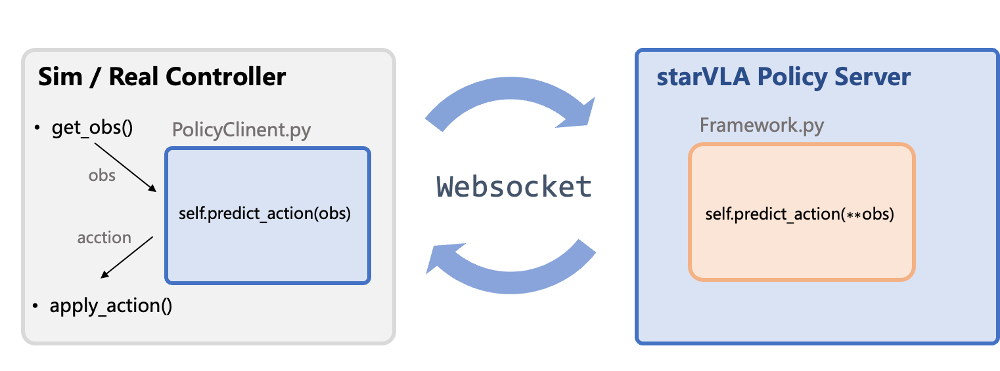
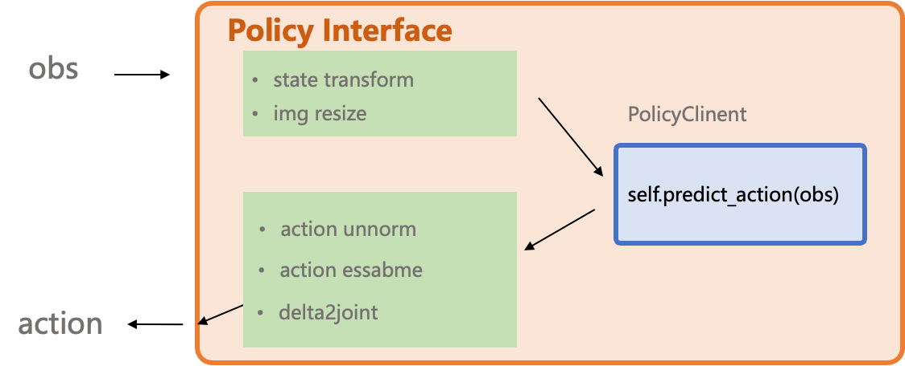

# StarVLA Evaluation Framework Usage Guide

## 1. Overview
StarVLA standardizes the inference pipeline for real-robot or simulation evaluations by tunneling data through WebSocket, enabling new models to be integrated into existing evaluation environments with minimal changes.


## 2. Architecture Diagram


The StarVLA framework uses a client-server architecture to separate the Evaluation Environment (Client) from the Policy Server (Model).




<details close>
<summary><b>Component Description </b></summary>

| Component             | Color Code | Description                                                                 |
|-----------------------|------------|-----------------------------------------------------------------------------|
| Sim / Real Controller | Grey       | External to StarVLA: Contains the core loop of the evaluation environment or robot controller, handling observation collection (`get_obs()`) and action execution (`apply_action()`). |
| PolicyClient.py & WebSocket & PolicyServer      | Blue       | Standard Communication Flow: Client-side wrapper responsible for data transmission (tunneling) and interfacing the environment with the server. |
| Framework.py          | Orange     | Model Infer Core: Contains the user-defined model inference function (`Framework.predict_action`), which is the main logic for generating actions. |

</details>


## 3. Data Protocol (Example dictionary contract)

Minimal pseudo-code example (evaluation-side client):

```python
import WebsocketClientPolicy

client = WebsocketClientPolicy(
    host="127.0.0.1",
    port=10093
)

while True:
    images = capture_multiview()          # returns List[np.ndarray]
    lang = get_instruction()              # may come from task scripts
    request = {
        "examples": [{
            "image": images,
            "lang": lang,
        }],
        "use_vlm_cache": True,            # optional: enable server-side VLM reuse
        "return_cache_info": True,        # optional: return hit/miss metadata for profiling
    }

    result = client.predict_action(request)   # --> forwarded to framework.predict_action
    action = result["data"]["normalized_actions"][0]
    apply_action(action)
```

### Notes
- Ensure every field in the request payload is JSON-serializable or convertible (lists, floats, ints, strings); convert custom objects explicitly.
- Images must be sent as `np.ndarray`. Perform `PIL.Image -> np.ndarray` before transmission and convert back on the server (`to_pil_preserve`) if required.
- Keep auxiliary metadata (episode IDs, timestamps, etc.) in dedicated keys so the framework can forward or log them without collisions.
- When instruction or task context changes, call `client.reset_cache()` before the next request so the server drops stale cached VLM features.
- Several provided evaluation wrappers now do this inside their `reset(...)` path automatically; if you build a custom client, follow the same pattern.
- `return_cache_info=True` adds cache hit / miss counters plus cache footprint metadata (`cache_entries`, `cache_bytes`) to the response, which is useful for latency benchmarks and debugging reuse behavior.
- The benchmark helper under `deployment/model_server/tools/benchmark_policy_server.py` uses the same request shape and, in compare mode, prints the latency delta and throughput uplift between forced cold requests and same-session reuse.


### PolicyClient Interface Design




The [`*2model_interface.py`](./LIBERO/eval_files/model2libero_client.py) interface is designed to wrap and abstract any variations originating from the simulation or real-world environment. It also supports user-defined controllers, such as converting delta actions to absolute joint positions.

## 7. FAQ

Q: Why do examples contain files such as `model2{bench}_client.py`?  
A: They encapsulate benchmark-specific alignment, e.g., action ensembling, converting delta actions to absolute actions, or bridging simulator quirks, so the model server can stay generic.

Q: Why does the model expect PIL images while the transport uses `ndarray`?  
A: WebSocket payloads do not serialize PIL objects directly. Convert to `np.ndarray` on the client side and restore to PIL inside the framework if the model requires it.

Feedback on environment-specific needs is welcome via issues.
